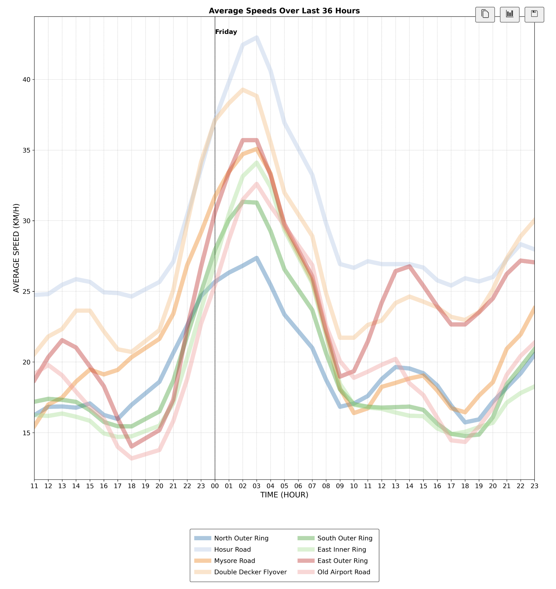
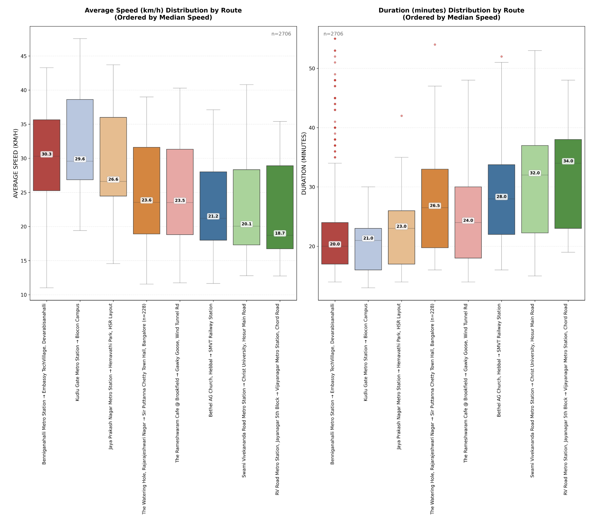
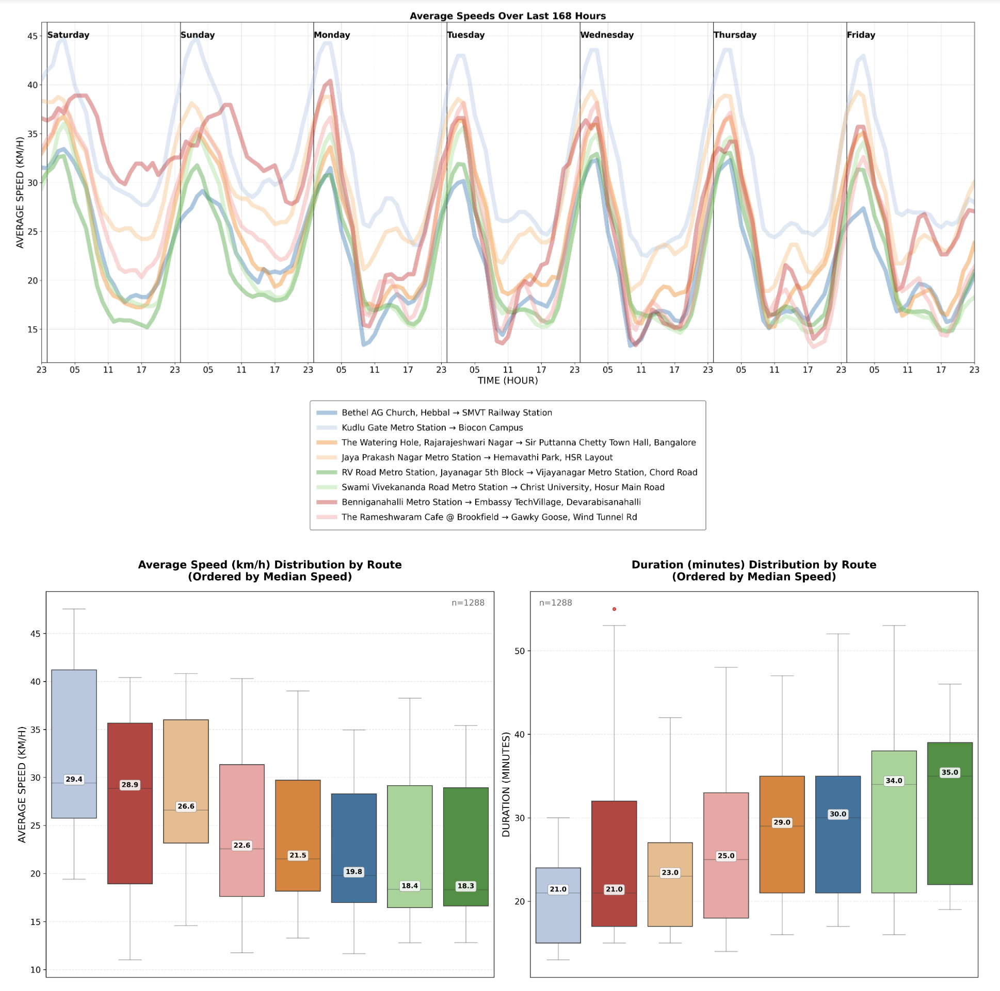
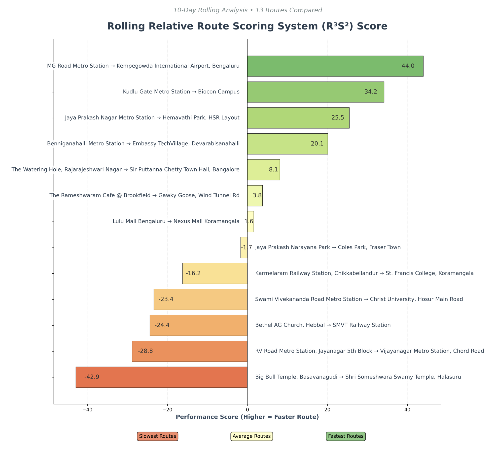

# 🚗📊 Bangalore Traffic Monitor - Complete User Guide

(((((  🚧 WORK ACTIVELY IN PROGRESS 🚧  ))))

## Introduction

A smart system that automatically monitors and analyzes real-time traffic conditions on key routes throughout Bangalore city. Perfect for commuters, city planners, and anyone curious about traffic patterns in India's Silicon Valley known best for... its traffic problems!

The system uses **Google Maps** to check travel times between various locations around Bangalore. It:

1. **Automatically visits** Google Maps for each route
2. **Extracts** current travel time and distance data
3. **Calculates** average speeds and traffic conditions
4. **Stores** everything in CSV files for analysis
5. **Generates** visual reports and insights

All of this happens automatically using web automation - no manual checking required!

## Table of Contents

- [Installation](#installation)
- [Quick Start](#quick-start)
- [Configuration](#configuration)
- [Usage](#usage)
- [Plotting and Visualization](#plotting-and-visualization)
- [Route Ranking System](#route-ranking-system)
- [Troubleshooting](#troubleshooting)
- [Advanced Customization](#advanced-customization)

## Installation

### Prerequisites

- Python 3.8 or higher
- Chrome browser (for web automation)
- Internet connection (for Google Maps access)

### Step-by-Step Setup

1. **Clone or download** the project files to your computer
2. **Open terminal/command prompt** and navigate to the project folder
3. **Create a virtual environment** (recommended):
   ```bash
   python -m venv venv
   source venv/bin/activate  # On Windows: venv\Scripts\activate
   ```
4. **Install dependencies**:
   ```bash
   pip install -r requirements.txt
   ```
5. **Verify installation**:
   ```bash
   python -c "import pandas, selenium, matplotlib, seaborn; print('All dependencies installed!')"
   ```

## Quick Start

### First Run

1. **Open the main script** (`traffic_monitor.py`) in your IDE or run it from terminal
2. **Run the script**:
   ```bash
   python traffic_monitor.py
   ```
3. The script will:
   - Open Chrome browser automatically
   - Visit Google Maps for each route
   - Extract travel times and distances
   - Save data to CSV files
   - Generate plots and analysis

### What You'll See

- **Browser windows** opening and closing (this is normal - the script is automating Google Maps)
- **CSV files** created in the project folder with traffic data
- **Plot windows** showing traffic analysis

### Sample Output

After the first run, you'll have:
- [csv-bangalore_traffic.csv](cci:7://file:///Users/home/DEV/MY%20PROJECTS/blr-traffic-monitor/csv-bangalore_traffic.csv:0:0-0:0) - All traffic data
- `csv-routes.csv` - Route definitions and labels
- Various plot visualizations

## Configuration

### Route Customization

Edit `routes_df` in [traffic_visual.ipynb](cci:7://file:///Users/home/DEV/MY%20PROJECTS/blr-traffic-monitor/traffic_visual.ipynb:0:0-0:0) to add/remove routes:

```python
routes_df = pd.DataFrame({
    "route_code": [
        "VJRQ+2M|RMJJ+F4",     # Kudlu Gate Metro Station → Biocon Campus
        "WH5F+26|WJ8X+F5W",    # Jaya Prakash Nagar Metro Station → Hemavathi Park, HSR Layout
        "XJPW+92|WJP4+FF",     # Swami Vivekananda Road Metro Station → Christ University, Hosur Main Road
        "2HVW+G8|XJXR+WG",     # Bethel AG Church, Hebbal → SMVT Railway Station
        "WGG8+G5|XH7P+G6",     # The Watering Hole, Rajarajeshwari Nagar → Sir Puttanna Chetty Town Hall, Bangalore
        "XPC7+72|XM33+J3",     # The Rameshwaram Cafe @ Brookfield → Gawky Goose, Wind Tunnel Rd
        "WHCJ+26|XGCP+FV",     # RV Road Metro Station, Jayanagar 5th Block → Vijayanagar Metro Station, Chord Road
        "XMW9+G8|WMJR+V4",     # Benniganahalli Metro Station → Embassy TechVillage, Devarabisanahalli
        "XHJ7+MG|WJM6+VC",     # Lulu Mall Bengaluru → Nexus Mall Koramangala
        "WHR9+R6|XJGF+6J",     # Big Bull Temple, Basavanagudi → Shri Someshwara Swamy Temple, Halasuru
    ]})
```

### Data Collection Settings

In `traffic_monitor.py`, customize:

```python
# How often to check traffic (in seconds)
CHECK_INTERVAL = 3600  # Check every hour

# How many times to run
MAX_ITERATIONS = 100   # Run 100 times (adjust as needed)

# Wait time between route checks
WAIT_BETWEEN_ROUTES = 5  # Wait 5 seconds between routes
```

## Usage

### Basic Data Collection

1. **Run the collector**:
   ```bash
   python traffic_monitor.py
   ```

2. **Monitor progress** - the script will print updates as it collects data

3. **Stop anytime** - press Ctrl+C to stop early

### Data Analysis

Open [traffic_visual.ipynb](cci:7://file:///Users/home/DEV/MY%20PROJECTS/blr-traffic-monitor/traffic_visual.ipynb:0:0-0:0) in Jupyter Notebook:

1. **Load and process data**:
   ```python
   # Load raw traffic data
   master_df = pd.read_csv("csv-bangalore_traffic.csv")
   
   # Process into analysis-ready format
   df = transformed_data(master_df)
   ```

2. **View data summary**:
   ```python
   display(df.describe())
   ```

## Plotting and Visualization

### Traffic Square (Time Series)

Show traffic speeds over time for all routes:

```python
# Basic plot - last 24 hours, short labels
df_plot = plot_traffic_square(df, days_offset=1, label='short', height='square', dpi=300)

# Advanced - last 7 days, full labels, wide format
df_plot = plot_traffic_square(df, days_offset=7, label='full', height='extrawide', dpi=300)
```


**Parameters:**
- `days_offset`: How many days back to show (1 = last 24 hours)
- `label`: 'short' (Hosur Road) or 'full' (Kudlu Gate Metro Station → Biocon Campus)
- `height`: 'square', 'wide', 'extrawide', 'extrawide2' (controls figure size and hour intervals)



### Route Boxplots

Compare route performance distributions:

```python
# Both speed and duration boxplots
plot_route_boxplots(df, avg_speed=True, duration=True, legend=True, show_stats=True)

# Speed only, no x-axis labels, no median annotations
plot_route_boxplots(df, avg_speed=True, duration=False, legend=False, show_stats=False)
```

**Parameters:**
- `avg_speed`: Include average speed boxplot
- `duration`: Include duration boxplot  
- `legend`: Show route labels on x-axis
- `show_stats`: Show median values and sample sizes on each box



### Chaining Plots

Use one plot's output as another's input:

```python
# Get time series data for last week
df_plot = plot_traffic_square(df, days_offset=7, label='full', height='extrawide', dpi=300)

# Generate boxplots from that data
plot_route_boxplots(df_plot, avg_speed=True, duration=True, legend=False)
```



## Route Ranking System

### Rolling Route Score (R³S²)

Calculate a 10-day rolling performance score:

```python
# Calculate 10-day rolling scores
df_rrs = calculate_rrs(df, DAYS_ROLLING=10)

# Add human-readable route names
df_rrs['route'] = df_rrs['route_code'].map(
    lambda x: locate(x.split('|')[0]) + '→' + locate(x.split('|')[1])
)
df_rrs = df_rrs[['route', 'points']]

display(df_rrs)
```

### Route Performance Visualization

Change the rolling window:

```python
# 5-day rolling score
df_rrs = calculate_rrs(df, DAYS_ROLLING=5)

# 30-day rolling score  
df_rrs = calculate_rrs(df, DAYS_ROLLING=30)
```


